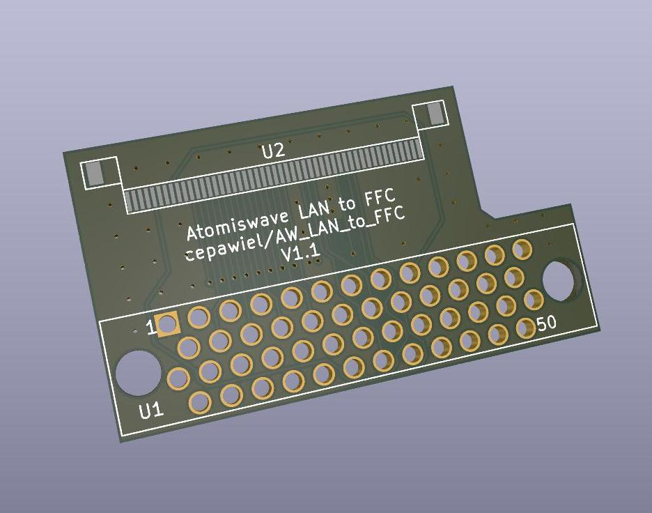

# AW_LAN_to_FFC
PCB to attach Atomiswave LAN adatpter to Dreamcast (acts as BBA) using FFC

## BOM
| Part              | Quantity | Description                              | URL                                                                                               |
|-------------------|----------|------------------------------------------|---------------------------------------------------------------------------------------------------|
| THD0515-50CL-SN   | 1        | 50Pin 0.5MM FFC Bottom Contact Connector | https://www.lcsc.com/product-detail/FFC-FPC-Connectors_THD-THD0515-50CL-SN_C283159.html           |
| JS05B-50P-150-4-8 | 1        | 50Pin 0.5MM FFC Opposite Side 15CM       | https://www.lcsc.com/product-detail/FFC-FPC-Connect-Cables_JUSHUO-JS05B-50P-150-4-8_C2857761.html |

## TODO

## Version history
### V1.0
Holes were too small for the pins to fit properly

### V1.1
Tested working, ordered from JLCPCB. I chose 1.6mm thickness, but I might try thiner next time to help make sure every pin is soldered well.